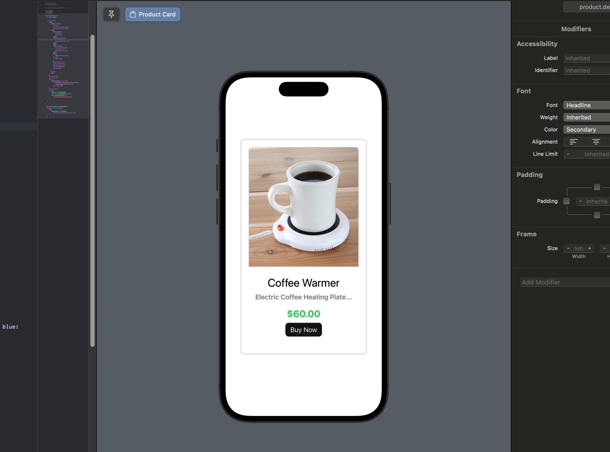

# Feature Flags in Swift iOS Sample

[Read the blog post here](https://configcat.com/blog/)

Using this iOS app, I’ve demonstrated how to conduct an A/B testing experiment in Swift using feature flags. The purpose of this experiment is to determine whether changing the product price text color to red will increase sales. The article demonstrated how feature flags can streamline this process.

## Build & Run

### Prerequisites

- A Mac computer
- The latest version of XCode

### How to run the app

1. Clone this repository
2. Open the `ab-testing-ios-sample.xcworkspace` file with Xcode
3. You should be able to see a preview of the app by selecting **ProductView** in the left sidebar

## Learn more

- [Swift Documentation](https://developer.apple.com/swift/) - learn about Swift.

[**ConfigCat**](https://configcat.com) also supports many other frameworks and languages. Check out the full list of supported SDKs [here](https://configcat.com/docs/sdk-reference/overview/).

You can also explore other code samples for various languages, frameworks, and topics here in the [ConfigCat labs](https://github.com/configcat-labs) on GitHub.

Keep up with ConfigCat on [Twitter](https://twitter.com/configcat), [Facebook](https://www.facebook.com/configcat), [LinkedIn](https://www.linkedin.com/company/configcat/), and [GitHub](https://github.com/configcat).

## Author

[Chavez Harris](https://github.com/codedbychavez)

## Contributions

Contributions are welcome!
